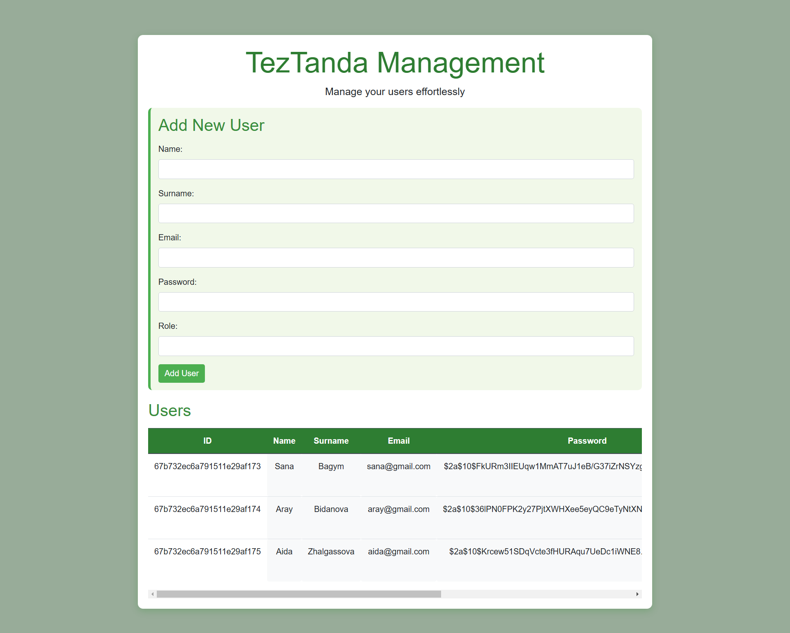
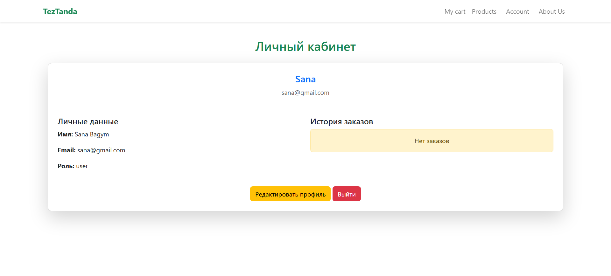
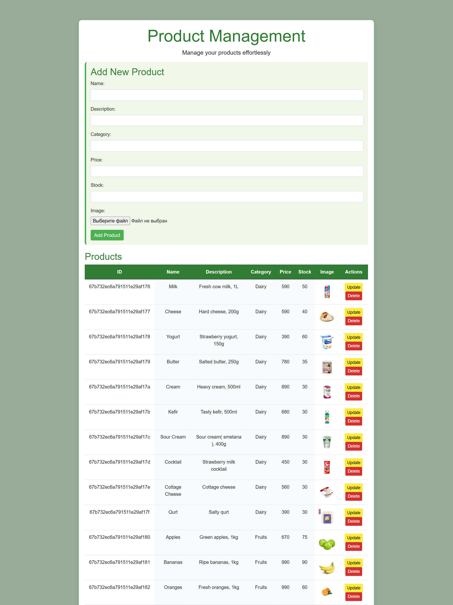
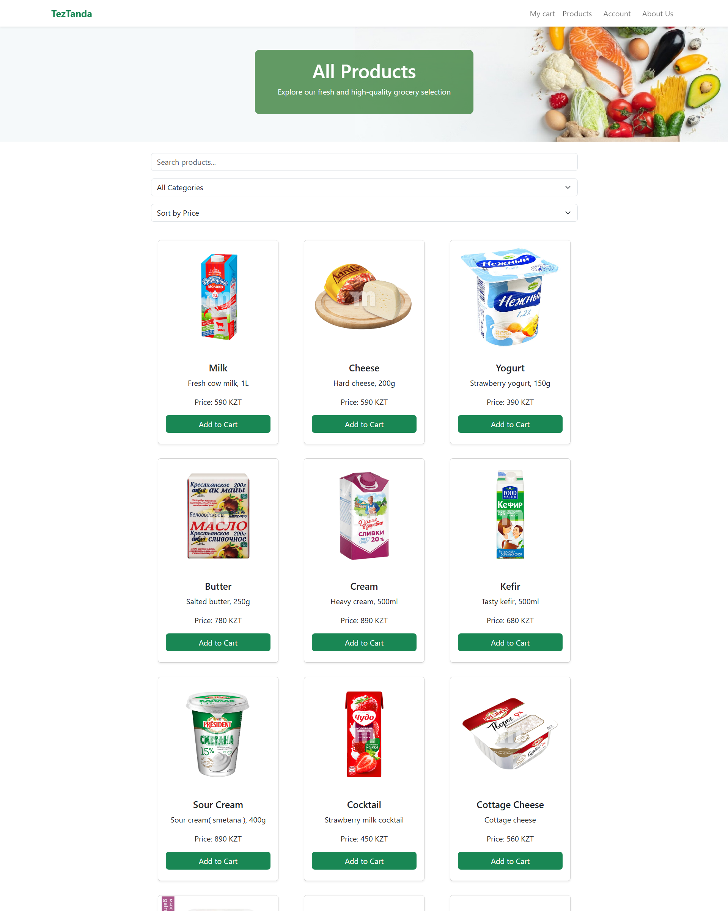
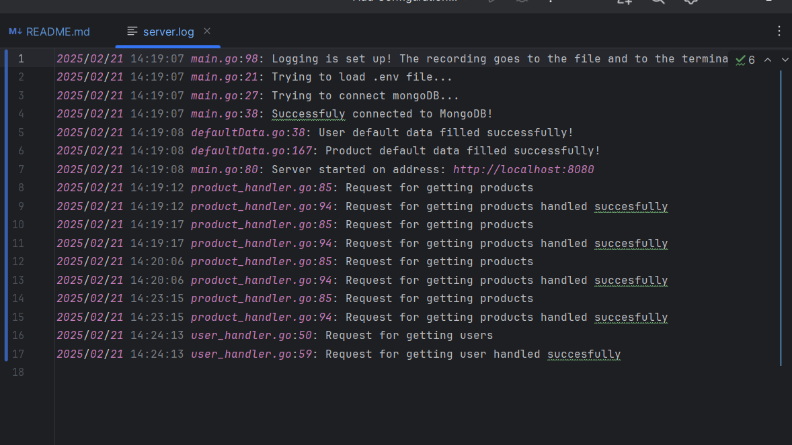

# 🛒 TezTanda - E-commerce Platform

## 🌟 Overview

TezTanda is a modern **e-commerce platform** built with **Golang** and **JavaScript**, offering seamless user authentication, product management, and shopping functionalities. Hosted on **Render**, it ensures a smooth and scalable experience.

## 📂 Features

### 🏪 **Database Requirements**
- ✅ Utilized **NoSQL MongoDB** as the database.
- ✅ Stored **100+ products and users**.
- ✅ Implemented **structured and unstructured data storage**.
- ✅ Optimized **search & retrieval operations** using **indexes**.

### 🔥 **Functional Requirements**
- **👤 User Authentication**
    - 🔑 Registration, Login, and Logout.
    - 🛡️ Implemented **JWT-based authentication**.

- **🛍️ Product Management**
    - 📌 Products include **name, price, description, category, stock, images**.
    - 🛠️ Full **CRUD operations** for both **products and users**.

- **🛒 Shopping Cart & Orders**
    - 🏷️ Users can **add products to the cart** and manage orders.

- **🔎 Search & Filtering**
    - 🔍 Implemented **full-text search** and filtering options (category, price range, availability).
    - 📊 Stored **user activity logs** (views, purchases, search history).

## 📸 Screenshots

| Home Page | Admin Panel | Users Page |
|-----------|------------|------------|
|  |  |  |

| Profile Page | Products Page | Shop Page |
|-------------|--------------|-----------|
|  |  |  |

| Code Base | Log File |
|----------|---------|
|  |  |

## 🚀 Deployment
- 🌎 Backend hosted on **Render**.
- 💾 Database hosted on **MongoDB Atlas**.

---

🔥 **TezTanda – A seamless shopping experience built for users!**  
